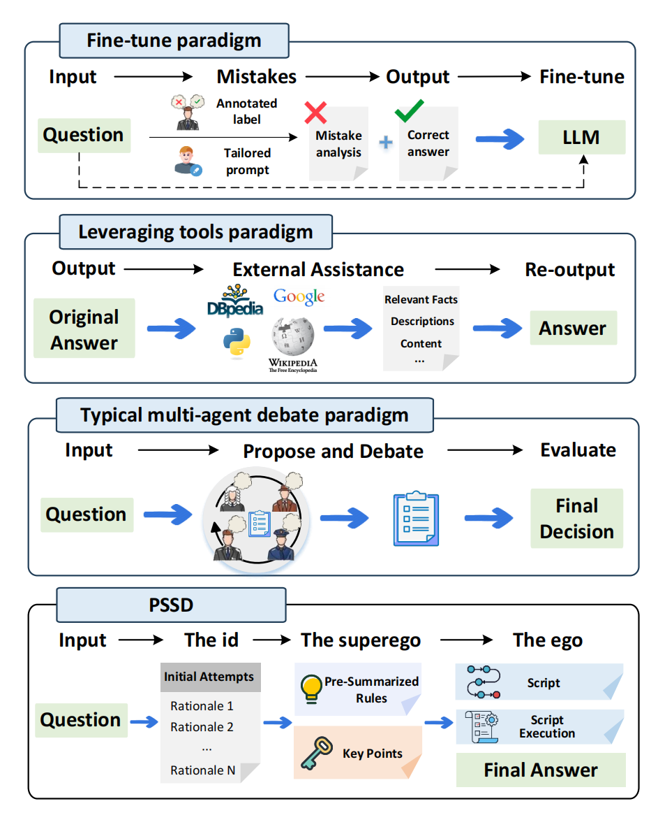

    <h1>   PSSD: Making Large Language Models Self-denial via Human Psyche Structure</h1>

    
     

The enhance of accuracy in reasoning results of LLMs arouses the community's interests, wherein pioneering studies investigate posthoc strategies to rectify potential mistakes. Despite extensive efforts, they are all stuck in a state of resource competition demanding significant time and computing expenses. The cause of the situation lies in the failure of identifying the fundamental feature of the solutions in this line, coined as the self-denial of LLMs. In other words, LLMs should confidently determine the potential existence of mistakes and carefully execute the targeted correction. As the whole procedure conducts within LLMs, supporting and persuasive references are hard to acquire, while the absence of specific steps towards refining hidden mistakes persists even when errors are acknowledged. In response to the challenges, we present PSSD, which refers to and implements the human psyche structure such that three distinct and interconnected roles contribute to human reasoning. Specifically, PSSD leverages the recent multi-agent paradigm, and is further enhanced with three innovatively conceived roles: (1) the intuitionbased id role that provides initial attempts based on benign LLMs; (2) the rule-driven superego role that summarizes rules to regulate the above attempts, and returns specific key points as guidance; and (3) the script-centric ego role that absorbs all procedural information to generate executable script for the final answer prediction. Extensive experiments demonstrate that the proposed design not only better enhance reasoning capabilities, but also seamlessly integrate with current models, leading to superior performance.

## 🌟Prompts
- All prompts for this project can be found in `./all_prompt.pdf`.

